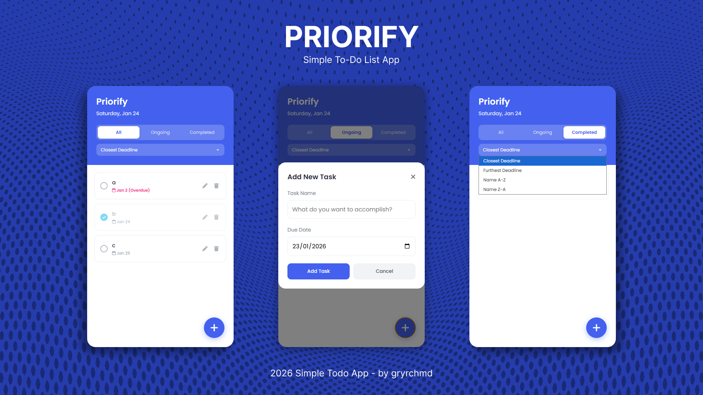

# 📝 Priorme - Smart To-Do & Calendar App (React + Vite)

> **Mini Project for Software Engineering Coding Camp by RevoU — Transitioned to React**

A lightweight, responsive, and persistent Smart To-Do & Calendar application built using **React 19**, **Vite**, **Modern JavaScript**, and **Vanilla CSS**.


## 📸 Screenshots


## ✨ Features

* **4 Calendar & List Views**:
  * 📅 **Day View**: 24-hour timeline with untimed / all-day sections
  * 📆 **Week View**: 7-day responsive grid with timed event blocks
  * 🗓️ **Month View**: Complete calendar month grid with task chips and overflow count
  * 📋 **List View**: Detailed list with sorting and instant completion toggles
* **Task & Event Support**: Differentiate between actionable to-dos (with deadline) and scheduled events (start/end times, location).
* **Priority System**: 5-level priority color coding (*Someday*, *Nice to Have*, *Normal*, *Important*, *URGENT!*).
* **Dark & Light Mode**: Built-in theme toggle with persistent preferences.
* **CRUD Operations & Modals**: Create, Read, Update, and Delete with instant UI reactivity.
* **Data Persistence**: Uses `localStorage` (`priorme_todos`) so your tasks are preserved automatically.
* **Smart Filtering & Sorting**: Filter by *All*, *Ongoing*, *Completed*, and sort by *Deadline*, *Name*, or *Priority*.
* **Responsive Design**: Full desktop sidebar and mobile-friendly slide-out drawer with backdrop.

## 🛠️ Tech Stack

* **Frontend Framework**: [React 19](https://react.dev/)
* **Build Tool & Dev Server**: [Vite 6](https://vitejs.dev/)
* **Styling**: Vanilla CSS with CSS Variables (`:root`), dark/light themes, and responsive design
* **Icons & Fonts**: FontAwesome 6, DM Sans & Syne (Google Fonts)

## 📂 Project Structure

```text
Priorme/
├── public/
│   └── image/                  # Static assets (logo, screenshots)
├── src/
│   ├── constants/
│   │   └── priorities.js       # Priority labels, levels & orders
│   ├── utils/
│   │   └── dateUtils.js        # Date formatting, week/month grid helpers
│   ├── hooks/
│   │   ├── useTodos.js         # Todo state management & localStorage sync
│   │   └── useTheme.js         # Dark / Light theme toggle hook
│   ├── components/
│   │   ├── layout/
│   │   │   ├── Sidebar.jsx     # Navigation, filters, and priority legend
│   │   │   └── Topbar.jsx      # Date controls, view toggles & theme switcher
│   │   ├── views/
│   │   │   ├── DayView.jsx     # 24h day timeline view
│   │   │   ├── WeekView.jsx    # 7-day grid week view
│   │   │   ├── MonthView.jsx   # Calendar month grid view
│   │   │   └── ListView.jsx    # Sortable task list view
│   │   ├── modals/
│   │   │   ├── TaskFormModal.jsx   # Add / Edit Task & Event modal
│   │   │   └── TaskDetailModal.jsx # Task detail view popup
│   │   └── common/
│   │       ├── TaskChip.jsx    # Reusable chip for all-day sections
│   │       └── EventBlock.jsx  # Absolutely positioned time blocks
│   ├── App.jsx                 # Root component wiring all views & state
│   ├── main.jsx                # React DOM mount entry point
│   └── index.css               # Design system & component stylesheets
├── index.html                  # HTML entry point
├── package.json
└── vite.config.js
```

## 🚀 Getting Started

### 1. Install dependencies
```bash
npm install
```

### 2. Start the development server
```bash
npm run dev
```
Open [http://localhost:5173](http://localhost:5173) in your browser.

### 3. Build for production
```bash
npm run build
```

## 👤 Author
**Mohammad Geresidi Rachmadi**
* **GitHub**: [@GeryRachmadi](https://github.com/GeryRachmadi)
* **LinkedIn**: [Mohammad Geresidi Rachmadi](https://www.linkedin.com/in/mgeresidir/)
* **Instagram**: [@gryrchmd](https://www.instagram.com/gryrchmd/)
